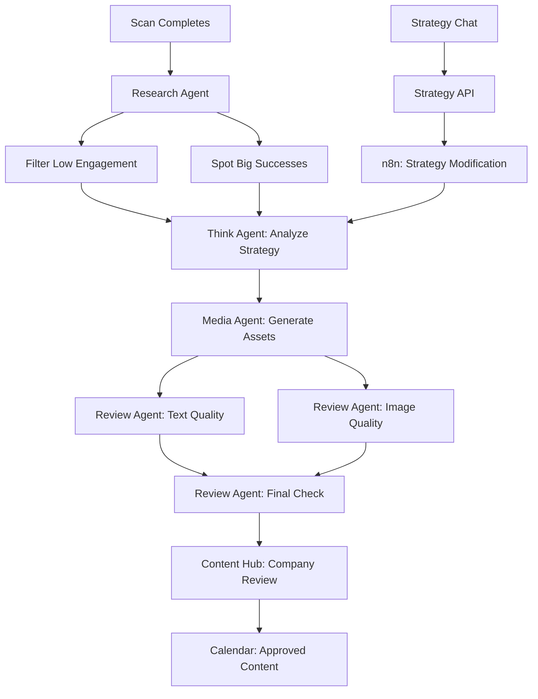

# n8n Agent Orchestration System - Quality Enhancement Summary

## ✅ Enhanced Implementation Complete

The n8n workflow system has been enhanced to focus on **highest quality content creation** for businesses and creators based on their OUTPUT over the last few years.

## 🎯 Key Enhancements

### 1. Research Agent - Critical Enhancement
**File: `backend/src/services/agents/researchAgent.ts`**

- **Filters Low Engagement Content**: Analyzes competitor content and filters out bottom 30% low performers
- **Spots Big Engagement Successes**: Identifies top 20% high-performing content
- **Success Factor Extraction**: Uses LLM to extract what makes competitor content successful
- **Engagement Pattern Analysis**: Calculates engagement rates and identifies patterns

**Key Functions:**
- `analyzeCompetitorEngagement()` - Filters low engagement, spots successes
- `extractSuccessFactors()` - LLM-powered analysis of what works

### 2. Review Agent - Quality Assurance
**File: `backend/src/services/agents/reviewAgent.ts`** (NEW)

**Two Filter Layers:**
1. **Generation Mistakes Filter**: 
   - Text quality review (grammar, clarity, engagement)
   - Brand alignment check
   - Strategic alignment verification
   - Platform optimization

2. **Image/Media Failures Filter**:
   - Image URL validation
   - Video URL validation
   - Media quality checks

**Multi-Layer Review Process:**
- Layer 1: Text Quality Review
- Layer 2: Brand Alignment Check
- Layer 3: Competitor Benchmarking
- Layer 4: Strategic Alignment
- Layer 5: Platform Optimization
- Final: Quality Check (placeholder text, completeness)

**Quality Threshold**: Content must score ≥70/100 and have <3 issues to be approved

### 3. Content Hub Integration
**Files:**
- `backend/src/routes/contentHub.ts` - API for reviewed content
- `components/ContentHubView.tsx` - Frontend integration

**Flow:**
1. Reviewed content stored via Helper Agent
2. Content Hub polls `/api/content-hub/reviewed` every 30 seconds
3. Reviewed content appears in Content Hub with "suggested" status
4. Company reviews and approves/rejects
5. Approved content can be added to calendar

### 4. Strategy Modification via Messaging
**Files:**
- `backend/src/routes/strategy.ts` - Strategy processing route
- `components/StrategyView.tsx` - Enhanced to trigger n8n workflows

**How It Works:**
1. User types message in Strategy section (e.g., "aim for more comedy style content similar to Competitor X")
2. Frontend calls `/api/strategy/process`
3. Backend triggers n8n workflow with `workflowType: 'strategy-modification'`
4. Master CMO Agent orchestrates:
   - Think Agent processes request
   - Think Agent optimizes content strategy
   - Research Agent enhances competitor intelligence (focusing on mentioned competitor/style)
5. New strategy plan created and content regenerated

## 📊 Complete Workflow Flow



## 🔄 Enhanced Workflow Types

### scan-complete (Enhanced)
1. Research Agent: Enhance competitor intelligence (filters low engagement, spots successes)
2. Think Agent: Analyze strategy using filtered data
3. Media Agent: Generate content assets
4. Review Agent: Review content quality (2 filter layers)
5. Review Agent: Final quality check
6. Helper Agent: Send to Content Hub

### strategy-modification (NEW)
1. Think Agent: Process user's strategy modification request
2. Think Agent: Optimize content strategy based on modification
3. Research Agent: Enhance competitor intelligence (focusing on mentioned competitor/style)
4. Results: New strategy plan created

### content-generation (Enhanced)
1. Think Agent: Optimize content strategy
2. Media Agent: Create media assets
3. Review Agent: Review text content
4. Review Agent: Review image content
5. Review Agent: Final quality check
6. Poster Agent: Store in Notion
7. Helper Agent: Send to Content Hub

## 🎯 Quality Standards

### Content Approval Criteria
- Quality Score: ≥70/100
- Maximum Issues: <3
- Brand Alignment: Must match brand DNA
- Strategic Alignment: Must support business goals
- Platform Optimization: Must be optimized for target platform

### Engagement Filtering
- **Top Performers**: Top 20% by engagement score
- **Low Performers**: Bottom 30% (filtered out)
- **Success Factors**: Extracted from top performers using LLM

## 📝 API Endpoints

### Strategy Modification
```
POST /api/strategy/process
{
  "message": "aim for more comedy style content similar to Competitor X",
  "username": "company.com",
  "brandDNA": {...},
  "competitorIntelligence": [...]
}
```

### Content Hub - Get Reviewed Content
```
GET /api/content-hub/reviewed
Returns: { success: true, items: [...] }
```

### Content Hub - Approve Content
```
POST /api/content-hub/reviewed/:id/approve
Moves content to calendar-ready status
```

### Content Hub - Reject Content
```
POST /api/content-hub/reviewed/:id/reject
{ "reason": "Doesn't match brand voice" }
```

## 🔑 Key Features

1. **Automatic Quality Filtering**: Low engagement content automatically filtered out
2. **Success Pattern Recognition**: Identifies what makes competitor content successful
3. **Multi-Layer Review**: 5 layers of quality checks before Content Hub
4. **Company Review Gate**: All content must be reviewed before calendar
5. **Strategy Modification**: Users can modify strategy via chat, triggers n8n workflow
6. **Content Hub Integration**: Reviewed content automatically appears in Content Hub

## 🚀 Next Steps

1. Test the complete flow: Scan → Research → Review → Content Hub → Calendar
2. Test strategy modification: Message in Strategy → n8n workflow → New content
3. Monitor quality scores and adjust thresholds if needed
4. Configure all required API keys for Research Agent (SerpAPI, NewsAPI, etc.)


